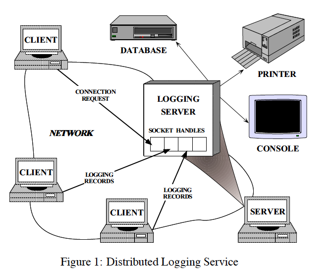
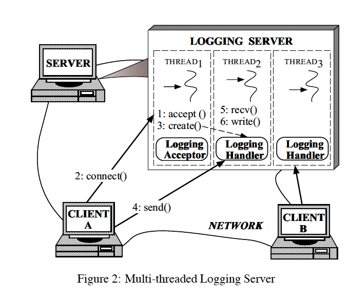
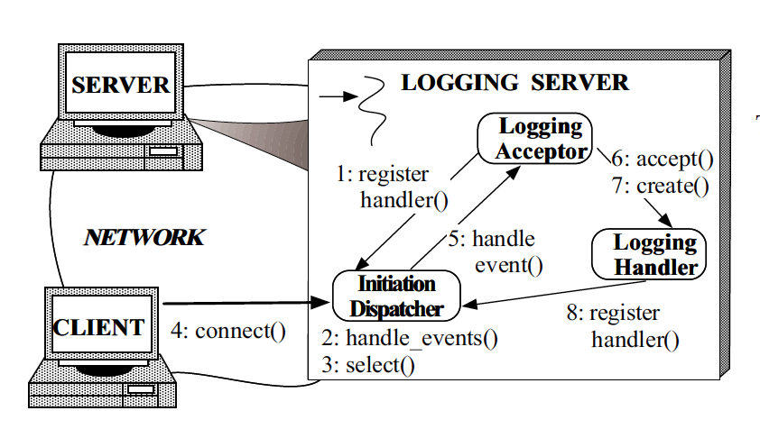
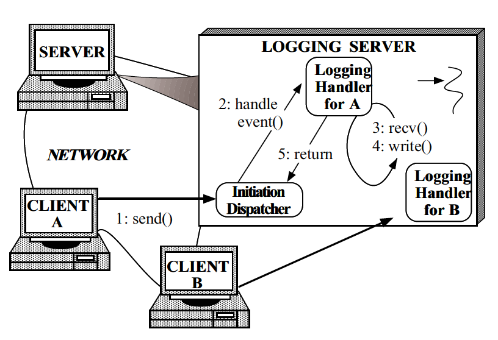
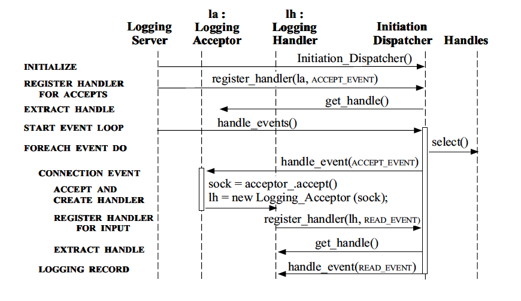

# Reactor

An Object Behavioral Pattern for
Demultiplexing and Dispatching Handles for Synchronous Events

## 目的

Reactor 设计模式处理由一个或者多个客户端同时提交给应用程序的服务请求（service requests）。

在应用程序中，每个服务可能由几个方法构成，并由负责分派服务特定的请求（Service-specific requests）的一个独立的事件处理器（event handler）表示。

事件处理器的分派由初始分发器（initiation dispatcher）执行，该分发器管理已注册的事件处理器。

服务请求的多路分离（demultiplexing）由一个同步事件多路分离器完成。

【注：通读全文之后，我理解的这个 `demultiplexing` 应该是包含了两部分，就是 `multiplexing` 和 `demultiplexing`，作者把整个过程都叫做 `demultiplexing`，其实也不一定非要把这个概念跟现有的概念类比或者联系起来，也许只是代表这个过程的一种称谓，个人理解，不一定准确，仅供参考】

【注：关于 Socket 中 demultiplexing 这个概念，可以看这篇文章：http://www.dcs.bbk.ac.uk/~ptw/teaching/IWT/transport-layer/notes.html】

## 别称

分发器（Dispatcher）, 通知器（Notifier）

## 例子

为了阐述 Reactor 模式，请看图1所示的运行着分布式日志记录服务的事件驱动服务器。



客户端在分布式环境中使用日志服务来记录他们的状态信息，这些信息通常包括错误通知、调试跟踪信息和性能报告等。日志记录被发往这个中央日志服务器，服务器可以把他们写入到各种输出设备，比如终端、打印机、文件或者网络数据库。

图 1 所示的这个日志服务器处理客户端发送来的日志记录，日志记录数据和连接请求可以同时出现在不同的句柄（Handle）上，句柄代表着由操作系统管理的网络通信资源【注：也就是图中的 `SOCKET HANDLES`】。

日志服务器跟客户端使用面向连接的协议通信，比如 `TCP` 协议，客户端如果想要记录数据必须先发送连接请求到服务器，服务器使用监听这些客户端已知的地址的 *句柄工厂（handle factory）* 等待这些连接请求的到来。当连接请求到达时，句柄工厂通过创建一个表示连接端点的新句柄，在客户端和服务器之间建立连接，这个句柄会返回给服务器，然后服务器等待客户端的服务请求到达这个句柄。一旦客户端跟服务器建立了连接，客户端就可以并发的发送日志记录到服务器，服务器可以通过这些已经建立连接的套接字（Socket ）句柄来接收这些记录。

也许开发一个支持并发的日志服务器最符合直觉的方式就是像图 2 中展示的那样使用多个线程来同时处理多个客户端。



这种方法同步地接受网络连接，并按照“一个线程一个连接（thread-per-connection）”的模式来处理客户端日志记录。然而，使用多线程在服务器中实现日志记录的处理无法解决以下问题：

- **效率**：因为上下文切换、同步和数据移动，多线程可能会导致性能低下

- **易于编程**：多线程可能需要复杂的并发控制方案

- **可移植性**：多线程并不是所有操作系统平台都可用

这些缺点导致了使用多线程开发一个并发日志服务器常常并不是最有效也不是最简洁的方案。

## 上下文

在分布式系统中，从一个或者多个客户端并发地接收事件的服务器应用。

## 问题

分布式系统中的服务器应用必须可以处理多个发送服务请求的客户端，然后在调用特定服务前，服务器应用程序必须多路分离（demultiplex）并将每个传入请求分派给相应的服务提供者。开发一个高效的服务器机制去多路分离和分派客户端请求需要解决以下问题：

- **可用性**：服务器即便是在等待其他请求到来时，也要保持对处理到来的请求可用。特别是，服务器不能在排除其他事件源的情况下无限期地阻止处理任何单个事件源，因为这可能会显著延迟对其他客户端的响应。

- **效率**：服务器必须最小化延迟、最大化吞吐量，并避免不必要地使用 CPU。

- **易于编程**：服务器的设计应该简化合适的并发策略的使用。

- **可变性**：集成新的或者改进的服务，如改变消息格式户这话添加服务端缓存，应该给现有的代码带来较少的修改和维护成本。举个例子，实现一个新的应用服务不应该需要修改通用的事件多路分离和分派机制。

- **移植性**：将服务器移植到新的操作系统平台不应该需要太多的工作量。

## 解决方案

集成事件的同步多路分离和处理事件的相应事件处理器的调度，此外，将特定于应用程序的分派和服务的实现跟通用事件多路分离和分派机制解耦。

为应用程序提供的每个服务引入一个独立的处理特定类型事件的 `Event Handler`，所有的 `Event Handler` 实现相同的接口。`Event Handlers` 向使用 `Synchronous Event Demultiplexer`  来等待事件发生的 `Initiation Dispatcher` 登记。当事件发生时，`Synchronous Event Demultiplexer` 会通知 `Initiation Dispatcher`，`Initiation Dispatcher` 会同步得回调跟这个事件关联的 `Event Handler`，接着 `Event Handler` 会将事件分派给实现了请求服务的方法。

## 结构

Reactor 模式包含以下几个主要的参与者：

### **`Handles` 句柄**

- 标识操作系统管理的资源，这些资源一般包括网络连接、打开的文件、计时器和同步对象等。在日志服务器中 `Handles` 用来标识 `Synchronous Event Demultiplexer` 用来等待事件发生的套接字端口（socket endpoint）。日志服务器感兴趣的两种事件是 *`connection`* 事件和 *`read`* 事件，它们分别代表传入的客户端连接和日志记录数据。日志服务器为每个客户端维护一个连接，这些连接在服务器中用套接字句柄指代。【注：跟 Windows 平台的句柄和 Linux 平台的文件描述符是类似的概念】

### **`Synchronous Event Demultiplexer` 同步事件多路分离器**

- `Synchronous Event Demultiplexer` 是在一组句柄上等待事件发生的数据块（Blocks），当可以在不阻塞的情况下启动对句柄的操作时，该数据块就会返回。一个常见的 I/O 事件的多路分离器是由 UNIX 和 Win32 操作系统平台提供的事件多路分离系统调用（system call）`select`，它会显示出那些进行同步操作调用也不会阻塞应用程序进程的句柄。

### **`Initiation Dispatcher` 初始分发器**

- `Initiation Dispatcher` 定义了登记、移除和分派 `Event Handler` 的接口。总的来看，`Synchronous Event Demultiplexer` 负责等待新事件的发生，当它发现新事件时，会通知 `Initiation Dispatcher` 去回调特定于应用程序的事件处理器。常见的事件包括连接接受事件、数据输入和输出事件以及超时事件。

### **`Event Handler` 事件处理器**

- 事件处理器指定一个由钩子方法组成的接口，它抽象地表示特定于服务的事件的调度操作。该方法必须被特定于应用程序的服务实现。

### **`Concrete Event Handler` 具体的事件处理器**

- 具体的事件处理器实现了事件处理器的钩子方法，同时也实现了使用特定于应用的方式处理事件的方法。应用程序向 `Initiation Dispatcher` 登记具体事件处理器来处理特定类型的事件，当事件到达时，`Initiation Dispatcher` 会回调适合的具体事件处理器的钩子方法。

  在日志服务器中有两种具体的事件处理器：`Logging Handler` 和 `Logging Acceptor`，`Logging Handler` 负责接收和处理日志记录数据，`Logging Acceptor` 把创建并连接 `Logging Handlers`，用于处理来自客户端的后续日志记录。

Ractor 模式参与者的接口可以用下面的类图说明：


## 动力系统

### 常用协作

Ractor 模式会出现以下的协作：

- 当应用程序向 `Initiation Dispatcher` 登记具体的事件处理器（`Concrete Event Handler`）的时候，应用程序会指明该 `Event Handler` 希望 `Initiation Dispatcher` 在关联的句柄上发生事件的时候通知它的事件类型。

- `Initiation Dispatcher` 要求每个 `Event Handler` 都把它内部的句柄返回给自己，这个句柄标识着操作系统里的 `Event Handler`。

- 等到所有的 `Event Handler` 登记之后，应用程序调用 `handle_events` 开启 `Initiation Dispatcher` 的事件循环。此时，`Initiation Dispatcher` 组合来自每个注册过的 `Event Handler` 的句柄，并使用 `Synchronous Event Demultiplexer` 等待事件在这些句柄上发生。比如，在 `TCP` 协议层使用 `select` 这个同步事件多路分离操作来等待客户端 `Logging Record` 事件在建立连接的套接字句柄上到来。

- 当与事件源对应的句柄“就绪”时， `Synchronous Event Demultiplexer` 会通知 `Initiation Dispatcher`，比如当 `TCP` 套接字“读就绪”时。

- `Initiation Dispatcher` 触发 `Event Handler` 的钩子方法【注：图中的 `handle_event(type)`】来响应就绪句柄上的事件。当事件发生时，`Initiation Dispatcher` 使用被事件源激活的句柄作为“键”来定位和分派`Event Handler`中合适的钩子方法。

- `Initiation Dispatcher` 调用 `handle_event` 这个 `Event Handler` 中的钩子方法来执行特定于应用的功能作为对事件的响应，发生的事件类型可以作为参数传进这个钩子方法，同时可以被这个方法内部使用来执行额外的特定于服务的多路分离和分派。其他可选的分派方案会在 9.4 部分阐述。

下面的交互图展示了应用代码和 Reactor 模式参与者之间的协作：


## 协作场景

Reactor 模式中的协作在日志服务器中可以用两个场景来说明，这些场景展示了使用响应式事件分派设计的日志服务器如何处理来自多个客户端的连接请求和日志数据。

### 客户端连接到响应式日志服务器

第一个场景展示了当一个客户端连接到日志服务器时需要几个步骤。



步骤序列总结如下：

1. 日志服务器（1）向 `Initiation Dispatcher` 注册 `Logging Acceptor` 来处理连接请求；
2. 日志服务器掉用`Initiation Dispatcher` 的 `handle_events` 方法（2）；
3. `Initiation Dispatcher` 调用同步事件多路分离操作 `select`（3）来等待连接请求或者日志数据到达；
4. 客户端连接（4）到日志服务器
5. `Logging Acceptor` 会收到 `Initiation Dispatcher` （5）关于这个新连接请求的通知；
6. `Logging Acceptor` 接收（6）这个新的连接；
7. `Logging Acceptor` 创建（7）一个 `Logging Handler` 来服务这个新的客户端；
8. `Logging Handler` 向 `Initiation Dispatcher` 注册（8）他的套接字句柄，并指示分发器当这个套接字“读就绪”的时候通知它。

### 客户端向响应式日志服务器发送日志记录数据

第二个场景展示了响应式日志服务器服务处理一个日志记录数据的步骤：



这个步骤可以总结如下：

1. 客户端发送（1）一个日志记录数据；
2. 当客户端的日志记录被操作系统加入套接字句柄的队列时，`Initiation Dispatcher` 会通知（2）套接字句柄关联的 `Logging Handler` ；
3. 记录被以非阻塞的方式接收（3）（步骤 2 和步骤 3 重复进行，直到日志记录被完全接收）；
4. `Logging Handler` 处理日志记录，并把结果写入（4）标准输出；
5. `Logging Handler` 将控制权交给（5） `Initiation Dispatcher` 的事件循环。

## 实现

这部分描述了如何使用 C++ 实现 Reactor 模式，下面描述的实现受到 ACE 通信软件框架中提供的可重用组件的影响。

### 选择 `Synchronous Event Demultiplexer` 机制

`Initiation Dispatcher` 使用 `Synchronous Event Demultiplexer` 同步等待，直到一个或者多个时间发生，这个过程通常使用操作系统事件多路分离的系统调用，比如 `select` 实现。`select` 调用指明哪些句柄可以执行 I/O 操作同时不会阻塞特定于应用的服务处理程序所在的系统进程。一般来说，`Synchronous Event Demultiplexer` 会在已经存在的操作系统机制的基础上开发，而不是由 Reactor 模式的开发者自行实现。

### 开发 `Initiation Dispatcher`

下面是开发 `Initiation Dispatcher` 的必要步骤：

**实现 `Event handler` 列表**：`Initiation Dispatcher` 维护了包含具体事件处理器的列表，因此，`Initiation Dispatcher` 会提供在运行时向列表注册和移除这些事件处理器的方法。这个列表可以采用多种方式实现，比如，如果句柄表示为小整数值的连续范围，则可以使用散列、线性搜索或直接索引。

**实现事件循环的入口点**：`Initiation Dispatcher` 事件循环的入口点应该使用 `handle_events` 方法提供，该方法控制由 `Synchronous Event Demultiplexer` 提供的句柄多路分离，同时还执行 `Event Handler` 的分派。整个应用程序的主事件循环常常被这个入口点控制着。

当时间发生时，`Initiation Dispatcher` 从同步事件多路分离调用返回，并通过为每个“就绪”句柄分配 `Event Handler` 的 `handle_event` 钩子方法来“反应”，这个钩子方法执行用户定义的代码并在它完成时把控制交还给`Initiation Dispatcher`。

下面的 C++ 类说明了 `Initiation Dispatcher` 开放接口的主要方法：

```c++
enum Event_Type
// = TITLE
// Types of events handled by the Initiation_Dispatcher.
//
// = DESCRIPTION
// These values are powers of two so their bits can be efficiently ‘‘or’d’’
// together to form composite values.
{
  ACCEPT_EVENT = 01,
  READ_EVENT = 02,
  WRITE_EVENT = 04,
  TIMEOUT_EVENT = 010,
  SIGNAL_EVENT = 020,
  CLOSE_EVENT = 040
};
class Initiation_Dispatcher
// = TITLE
// Demultiplex and dispatch Event_Handlers in response to client requests.
{
public:
  // Register an Event_Handler of a particular Event_Type (e.g., READ_EVENT, ACCEPT_EVENT, etc.).
  int register_handler (Event_Handler *eh, Event_Type et);
  // Remove an Event_Handler of a particular Event_Type.
  int remove_handler (Event_Handler *eh, Event_Type et);
  // Entry point into the reactive event loop.
  int handle_events (Time_Value *timeout = 0);
};
```

**实现必要的同步机制**：如果 Reactor  模式是在只有一个控制线程的应用中使用，则可以消除所有的同步，在这种情况下，`Initiation Dispatcher` 串行处理应用程序进程内 `Event Handler` 的 `handle_event` 钩子方法。

然而，`Initiation Dispatcher` 还可以在多线程应用中的充当中央事件分派器的角色，在这种情况下，`Initiation Dispatcher` 程序的关键部分必须串行化来防止当修改或者激活共享状态变量（比如保存着 `Event Handlers` 的列表）时产生竞态条件。防止竞态条件的一种常见技术是使用互斥机制，如信号量或互斥量变量。

为了防止自死锁，互斥机制可以使用递归锁【注：也叫可重入锁】，当递归锁被在 `Initiation Dispatcher` 内跨越多个 `Event Handler` 钩子方法的同一个线程持有时，可以阻止死锁。递归锁可以被已经持有锁的线程不需要阻塞就可以重新获取，这个属性很重要，因为 Reactor 的 `handle_events` 方法被特定于应用的 `Event Handlers` 回调。应用程序钩子方法代码随后可能通过 `Initiation Dispatcher` 的 `register_handler` 和 `remove_handler` 方法重新进入它。

### 决定分派目标的类型

可以将两种不同的 `Event Handlers` 跟 `Handle` 联系起来作为 `Initiation Dispatcher` 的分派逻辑的目标。Reactor 模式的实现可以选择下面分派方法中的一个或者全部：

**`Event Handler` 对象**：一个常用的将 `Event Handler` 和 `Handle` 关联起来的方法是把 `Event Handler` 实现成对象。比如说，如第七部分描述的 Reactor 实现将 `Event Handler` 作为子类对象注册到 `Initiation Dispatcher` 。 使用对象作为分派目标可以方便地子类化 `Event Handlers`，以便重用和扩展现有组件，此外，对象还能将服务的状态和方法集成到单个组件中。

**`Event Handler` 方法**：另外一个把 `Event Handler` 和 `Handle` 关联起来的方法是注册一个方法到 `Initiation Dispatcher`，使用方法作为分派对象的好处是不需要定义一个新的类继承 `Event Handler` 就能很方便的注册回调。

适配器模式可以同时支持对象和函数。例如，可以使用事件处理器对象定义适配器，该事件处理程序对象包含指向事件处理程序函数的指针，当在事件处理器适配器上调用 `handle_event` 方法时，它能够自动将调用转发到它持有的事件处理器方法。

### 定义事件处理接口

假设我们使用 `Event Handler` 对象而不是方法，下一步就是定义 `Event Handler` 的接口，有两种方法：

**单方法接口**：第 7 节中的 OMT 图说明了 `Event Handler` 基类接口的实现，该接口包含一个名为 `handle_event` 的方法，`Initiation Dispatcher` 使用该方法来分派事件，在种情况下，已发生事件的类型作为参数传递给该方法。

下面的 C++ 抽象基类展示了单方法接口：

```c++
class Event_Handler
// = TITLE
// Abstract base class that serves as the
// target of the Initiation_Dispatcher.
{
public:
  // Hook method that is called back by the
  // Initiation_Dispatcher to handle events.
  virtual int handle_event (Event_Type et) = 0;
  // Hook method that returns the underlying I/O Handle.
  virtual Handle get_handle (void) const = 0;
};
```

单方法接口的优势是可以在不改动接口的情况下增加新的事件类型，但是，这种方法鼓励在子类的 `handle_event` 方法中使用 `switch` 语句，限制了它的扩展性。

**多方法接口**：另外一个实现 `Event Handler` 接口的办法是为每种时间类型定义一个单独的方法，比如 `handle_input`, `handle_output`, `handle_timeout`。

下面的 C++ 抽象基类展示了多方法接口

```c++
class Event_Handler
{
public:
  // Hook methods that are called back by
  // the Initiation_Dispatcher to handle
  // particular types of events.
  virtual int handle_accept (void) = 0;
  virtual int handle_input (void) = 0;
  virtual int handle_output (void) = 0;
  virtual int handle_timeout (void) = 0;
  virtual int handle_close (void) = 0;
  // Hook method that returns the underlying I/O Handle.
  virtual Handle get_handle (void) const = 0;
};
```

多方法接口的好处是很容易选择性地覆盖基类中的方法，并避免进一步在 hook 方法中，例如通过 `switch` 或 `if` 语句，多路分离。然而，这要求框架开发者能够提前预知 `Event Handler` 的方法集合。比如，上面在 `Event_Handler` 接口中的各种 `handle_*` 方法是为 UNIX `select` 机制中可用的 I/O 事件定制的，但是这个接口还不够广泛到足以包含所有通过 Win32 `WaitForMultipleObjects` 机制处理的事件类型。

以上描述的两种方式是在 [3] 中提到的钩子方法模式和在 [7] 中提到的回调工厂模式的例子，这些模式的目的是提供良好定义的钩子方法，可以被应用程序专用，也可以被低级的分派代码调用。

【注3: W. Pree, Design Patterns for Object-Oriented Software Development. Reading, MA: Addison-Wesley, 1994.】

【注7: S. Berczuk, “A Pattern for Separating Assembly and Processing,” in Pattern Languages of Program Design (J. O. Coplien and D. C. Schmidt, eds.), Reading, MA: Addison-Wesley,1995.】

### 决定 `Initiation Dispatchers` 的数量

很多应用程序可以使用一个 Reactor 模式就能够组织起来，这种情况下，`Initiation Dispatcher` 可以用单例模式实现，这种设计对在应用中把事件多路分离和分派集中到单一的位置很有帮助。

然而，有些操作系统限制了单个控制线程中可以等待的 `Handles` 数量，比如，Win32 允许 `select` 和 `WaitForMultipleObjects` 在单个线程中等待的 `handle` 数量不超过 64，这种情况下，创建每个线程单独运行一个 Reactor 实例的多线程模式可能就是必要的。

注意，`Event Handlers` 只能在一个 Reactor 模式实例中串行，因此，多个 `Event Handlers` 在多线程中可以并行运行，如果 `Event Handlers` 在不同的线程中访问共享状态，这个情况可能需要使用额外的同步机制。

### 实现具体的事件处理器

具体的事件处理器一般被应用开发者创建来执行指定的服务以响应特定的事件，开发人员必须确定当起始调度程序（`Initiation Dispatcher`）调用相应的钩子方法时要执行什么处理。

下面的代码实现了第 3 节描述的日志服务器中的具体事件处理器，这些处理器提供了*被动连接建立*（`Logging Acceptor`）和*数据接收*（`Logging Handler`）功能。

**`Logging Acceptor` 类**：该类是 `Acceptor-Connector` 模式的 `Acceptor` 组件的一个示例，`Acceptor-Connector` 模式把服务初始化的任务和服务初始化完成之后要执行的任务解耦，允许服务的特定于应用程序的部分（如 `Logging Handler`）独立于用于建立连接的机制而变化。

`Logging Acceptor` 被懂得接受来自客户端应用的连接，并且创建接收和处理来自客户端的日志记录数据的特定于客户端的 `Logging Handler` 对象。`Logging Acceptor` 中主要的方法和数据成员定义如下：

```c++
class Logging_Acceptor : public Event_Handler
// = TITLE
// Handles client connection requests.
{
public:
  // Initialize the acceptor_ endpoint and
  // register with the Initiation Dispatcher.
  Logging_Acceptor (const INET_Addr &addr);
  // Factory method that accepts a new
  // SOCK_Stream connection and creates a
  // Logging_Handler object to handle logging
  // records sent using the connection.
  virtual void handle_event (Event_Type et);
  // Get the I/O Handle (called by the
  // Initiation Dispatcher when
  // Logging_Acceptor is registered).
  virtual HANDLE get_handle (void) const
  {
  	return acceptor_.get_handle ();
  }
private:
  // Socket factory that accepts client connections.
  SOCK_Acceptor acceptor_;
};
```

`Logging Acceptor` 继承了 `Event Handler` 基类，这让应用程序向 `Initiation Dispatcher` 注册 `Event Handler` 成为可能。

`Logging Acceptor` 还包含了一个 `SOCK Acceptor` 实例，这是一个具体的工厂，它使 `Logging Acceptor` 能够在监听通信端口的被动模式 socket 上接受连接请求。当客户端的请求到来时，`SOCK Acceptor` 接受连接并产生一个 `SOCK Stream` 对象，此后，`SOCK Stream` 对象可以用来在客户端和日志服务器间可靠的传递数据。

实现日志服务器使用的 `SOCK Accpetor` 和 `SOCK Stream` 类是 ACE 提供的 C++ socket 包装库的一部分，这些 socket 包装器将 socket 接口的 `SOCK Stream` 语义封装在一个可移植的、类型安全的面向对象接口中，在 Internet 领域，`SOCK Stream` 套接字是使用 TCP 实现的。

下面代码展示了 `Logging Acceptor` 的构造器中它向 `Initiation Dispatcher` 单例实例注册 `ACCEPT` 事件：

```c++
Logging_Acceptor::Logging_Acceptor(const INET_Addr &addr) : acceptor_ (addr)
{
	// Register acceptor with the Initiation
	// Dispatcher, which "double dispatches"
	// the Logging_Acceptor::get_handle() method
	// to obtain the HANDLE.
	Initiation_Dispatcher::instance()-> register_handler (this, ACCEPT_EVENT);
}
```

此后，无论何时有客户端连接到来，`Initiation Dispatcher` 会回调 `Logging Acceptor` 的 `handle_event` 方法，如下：

```c++
void Logging_Acceptor::handle_event (Event_Type et)
{
	// Can only be called for an ACCEPT event.
	assert (et == ACCEPT_EVENT);
	SOCK_Stream new_connection;
	// Accept the connection.
	acceptor_.accept (new_connection);
	// Create a new Logging Handler.
	Logging_Handler *handler = new Logging_Handler (new_connection);
}
```

`handle_event` 方法调用 `SOCK Acceptor` 的 `accept` 方法被动的创建一个 `SOCK Stream` 对象，一旦 `SOCK Stream` 跟新客户端建立连接，程序会动态分配一个 `Logging Handler` 来处理日志数据请求。如下所示，`Logging Handler` 向 `Initiation Dispatcher` 注册它自己，`Initiation Dispatcher` 会将跟它关联的客户端的所有的日志记录多路分离给它。

**`Logging Handler` 类**：日志服务器使用 `Logging Handler` 类来接收客户端应用发送的日志记录。如下：

```c++
class Logging_Handler : public Event_Handler
// = TITLE
// Receive and process logging records
// sent by a client application.
{
public:
	// Initialize the client stream.
	Logging_Handler (SOCK_Stream &cs);
	// Hook method that handles the reception
	// of logging records from clients.
	virtual void handle_event (Event_Type et);
	// Get the I/O Handle (called by the
	// Initiation Dispatcher when
	// Logging_Handler is registered).
	virtual HANDLE get_handle (void) const
	{
		return peer_stream_.get_handle ();
	}
private:
	// Receives logging records from a client.
	SOCK_Stream peer_stream_;
};
```

`Logging Handler` 继承了 `Event Handler`，这使它能够被注册到 `Initiation DIspatcher`，如下：

```c++
Logging_Handler::Logging_Handler(SOCK_Stream &cs) : peer_stream_ (cs)
{
	// Register with the dispatcher for
	// READ events.
	Initiation_Dispatcher::instance ()-> register_handler (this, READ_EVENT);
}
```

一旦它被创建出来，`Logging Handler` 会向 `Initiation Dispatcher` 单例实例注册自己来处理 `READ` 事件，然后，当有日志记录请求到达，`Initiation Dispatcher` 自动分派到关联的 `Logging Handler` 的 `handle_event` 方法，如下所示：

```c++
void Logging_Handler::handle_event (Event_Type et)
{
	if (et == READ_EVENT) {
		Log_Record log_record;
		peer_stream_.recv ((void *) log_record, sizeof log_record);
		// Write logging record to standard output.
		log_record.write (STDOUT);
	}
	else if (et == CLOSE_EVENT) {
		peer_stream_.close ();
		delete (void *) this;
	}
}
```

当套接字句柄上有 READ 事件发生时，`Initiation Dispatcher` 调用 `Logging Handler` 的 `handle_event` 方法，这个方法接收、处理并且把日志记录写到标准输出（STDOUT），同样的，当客户端关闭连接时，`Initiation Dispatcher` 传递一个 CLOSE 事件，通知 `Logging Handler` 关闭它的 `SOCK Stream` 并删掉自己。

### 实现服务器

日志服务器只包含一个 `main` 函数。

**日志服务器 `main` 函数**：这个方法实现了一个单线程的并发日志服务器，并在 `Initiation Dispatcher` 的事件循环中等待。当客户端请求到来时，`Initiation Dispatcher` 调用适合的 `Concrete Event Handler` 的钩子方法来接受请求，接收和处理日志记录。日志服务器的主入口点定义如下：

```c++
// Server port number.
const u_short PORT = 10000;
int main (void)
{
	// Logging server port number.
	INET_Addr server_addr (PORT);
	// Initialize logging server endpoint and
	// register with the Initiation_Dispatcher.
	Logging_Acceptor la (server_addr);
	// Main event loop that handles client
	// logging records and connection requests.
	for (;;)
		Initiation_Dispatcher::instance ()-> handle_events ();
	/* NOTREACHED */
	return 0;
}
```

主程序创建了一个 `Logging Acceptor` 实例，它的构造方法用日志服务器的端口初始化了自己，然后主程序就进入了事件循环中。随后，`Initiation Dispatcher` 使用 `select` 这个事件多路分离系统调用来同步等待客户端的连接请求和日志记录的到来。

下面的图表展示了参与日志服务器的对象之间的协作流程：




【🔚】

